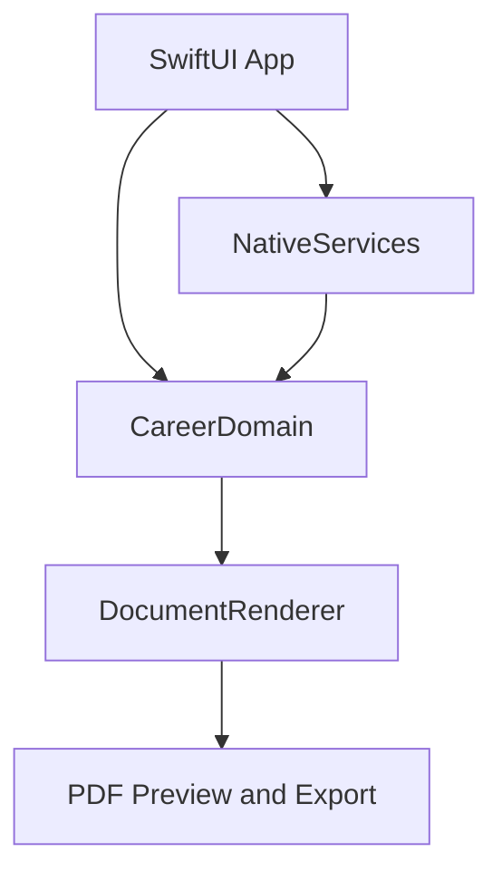

# Product and technical specification

## 1. Product

**Store name:** 履歴書・職務経歴書 AI作成 [AI Résumé & Work History Maker]

**One-sentence promise:** Create accurate Japanese job-application documents without an account; use on-device AI for wording on supported devices, then preview the exact PDF before submitting.

**Initial market:** Japan.

**Platforms:** Universal iPhone and iPad app. The iPad build can run on Apple-silicon Mac through the standard App Store compatibility path after device testing; a separate macOS target is not required for version 1.0.

## 2. Validated customer problem

The Japanese market already demonstrates demand through established résumé builders with thousands of ratings. Repeated complaints identify the improvement surface:

- entered data and exported PDF do not match;
- long work histories disappear or templates revert;
- line breaks, typography, and file size are unreliable;
- Japanese-era dates are awkward;
- fees or recruiter contact are disclosed too late;
- users want a direct, private path from facts to a submission-ready file.

The product competes by being more reliable, more convenient, and more fairly priced—not by inventing a new behavior customers must learn.

## 3. Locked scope

### Free

- One résumé.
- One work-history document.
- Exact PDF preview.
- One clean PDF export.
- Manual entry and editing.
- Gregorian and Japanese-era date handling.
- Local autosave.

### Pro

- Unlimited documents, variants, and exports.
- On-device AI drafting and tailoring on supported hardware and OS versions.
- OCR-assisted import.
- Cover-letter generation.
- Application tracker.
- Version history.
- Portrait cleanup using native image processing.
- Private iCloud sync.

### Explicitly out of scope for version 1.0

- Recruiter marketplace or lead selling.
- Public profiles or social features.
- Cloud LLMs.
- Custom account system.
- Web backend.
- Job-board scraping.
- Automated application submission.
- Claims that AI guarantees interviews or employment.

## 4. Locked monetization

| Product | Price | Notes |
|---|---:|---|
| Pro monthly | ¥500/month | Auto-renewable subscription |
| Pro annual | ¥3,000/year | Auto-renewable; equivalent to ¥250/month |
| Lifetime | Not offered | Ongoing sync and product maintenance justify recurring value |
| Free trial | Not offered | The free tier demonstrates the complete core output directly |

The paywall must show localized StoreKit prices, renewal period, restore purchases, manage subscription, privacy policy, and terms. Cancellation remains available through Apple's subscription management.

## 5. Locked technology stack

| Layer | Native technology | Responsibility |
|---|---|---|
| Language | Swift 6 | Strict concurrency and domain implementation |
| UI | SwiftUI + Observation | Adaptive iPhone/iPad interface and state flow |
| Minimum deployment | iOS/iPadOS 18 | Broad device reach for deterministic core features |
| Native AI | Foundation Models framework, runtime-gated | Rewrite, summarize, tailor, and propose wording from confirmed facts |
| Scanning and OCR | VisionKit + Vision | Document capture and local text recognition |
| Portrait tools | PhotosUI + Vision person segmentation | User-selected image import and local background cleanup |
| Persistence | SwiftData | Local structured records, documents, and versions |
| Sync | SwiftData + private CloudKit | Optional private cross-device synchronization |
| PDF layout | Core Text + Core Graphics + UIGraphicsPDFRenderer | Deterministic templates, pagination, and export |
| PDF preview | PDFKit | Exact preflight view of the exported artifact |
| Purchases | StoreKit 2 | Subscription purchase, entitlement, restoration, and localized pricing |
| Security | Data Protection + Keychain + LocalAuthentication | Protected local data and optional app lock |
| Diagnostics | OSLog + MetricKit | Privacy-preserving local diagnostics; no third-party analytics SDK |
| Tests | Swift Testing, XCTest UI, StoreKit Test, golden-PDF fixtures | Domain, purchase, accessibility, UI, and renderer regression coverage |

Foundation Models must be weak-linked/runtime-checked. On devices that do not support the system model, the deterministic editor, OCR, PDF, tracker, and sync remain available; AI actions show a precise availability explanation.

## 6. Architecture

### CareerDomain

A pure Swift package containing:

- `CareerProfile`, `Employment`, `Education`, `Qualification`, `Skill`, `Application`, and `DocumentVariant` models;
- Gregorian/Japanese-era conversions;
- validation and completeness rules;
- fact provenance and user-confirmation state;
- template selection and section ordering;
- deterministic subscription entitlements.

It must not import SwiftUI, Foundation Models, PDFKit, CloudKit, or StoreKit.

### DocumentRenderer

- Converts a validated immutable document snapshot into pages.
- Uses explicit font metrics, line breaking, column widths, and overflow rules.
- Produces the same layout for preview and export.
- Reports page count, file size, clipped content, missing required fields, and image-resolution warnings before export.

### NativeServices

Adapters for Foundation Models, Vision/VisionKit, PhotosUI, CloudKit, StoreKit 2, LocalAuthentication, sharing, and printing. Every adapter is protocol-backed so the engine and UI can use deterministic test doubles.

## 7. AI boundary

### AI may

- turn confirmed bullet points into a concise self-promotion statement;
- propose a motivation statement using the user's facts and target role;
- shorten, expand, or change tone;
- identify possibly missing information as a question;
- summarize responsibilities and achievements;
- suggest keywords already supported by the record.

### AI may never silently

- invent or change an employer, school, date, title, qualification, metric, or achievement;
- infer protected or sensitive attributes;
- overwrite the canonical career record;
- submit, share, or sync a document;
- promise hiring outcomes.

Every generation request supplies only the minimum confirmed fields required. Output lands in a proposal state with a clear diff and requires user approval before entering a document version.

## 8. Core flow

1. Start without creating an account.
2. Enter facts manually or import a scan with OCR.
3. Review and confirm extracted facts.
4. Select résumé, work-history document, or cover letter.
5. Optionally ask native AI to draft text from confirmed facts.
6. Approve, edit, or discard each suggestion.
7. View the exact PDF, validation warnings, page count, and file size.
8. Export with the native share sheet or print.
9. Optionally enable private iCloud sync and application tracking.

## 9. Data and privacy

- Local-first by default; no account required.
- No ads, tracking, data broker, recruiter lead flow, or third-party analytics.
- No cloud AI and no prompts sent to the developer.
- iCloud sync is optional and uses the user's private CloudKit database.
- Photos are accessed through the system picker; full photo-library access is unnecessary.
- Camera access is requested only when the user starts scanning.
- Face ID/Touch ID is requested only when the user enables app lock.
- Deleting a local profile removes its local document data; synced deletion behavior must be verified against the final CloudKit implementation.

The planned App Privacy answer is “Data Not Collected,” but it cannot be finalized until the signed archive, entitlements, privacy manifests, network traffic, and any included SDKs have been inspected.

## 10. Quality gates

- Golden-PDF tests for every template, Japanese-era boundary, long address, long company name, multi-page work history, and missing portrait.
- Preview and exported PDF render from the same immutable snapshot.
- Zero clipped or silently omitted fields.
- Offline test for the full free path and all non-sync Pro features.
- AI hallucination tests ensure generated prose cannot mutate canonical facts.
- StoreKit Test covers purchase, renewal, expiration, refund, restore, family/account changes, and offline entitlement cache.
- CloudKit tests cover conflict resolution, deletion, duplicate records, and first-sync migration.
- VoiceOver, Dynamic Type, Reduce Motion, contrast, keyboard, Japanese input, and iPad multitasking checks.
- Supported-device testing plus a 2020 iPhone SE-class fallback test without native AI availability.

## 11. Deliberate exclusions

Do not add React Native, Flutter, Firebase, a custom backend, an external LLM, HTML-to-PDF rendering, custom authentication, or a custom synchronization service unless a later verified requirement cannot be met natively.

