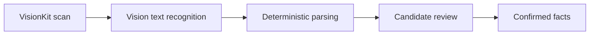

# Native AI and import pipeline

**Status:** `LOCKED`

## Foundation Models boundary

Use Foundation Models only for semantic drafting. The app creates a `LanguageModelSession` per writing task or short revision chain rather than one unbounded session for the whole app.

At runtime:

1. Check OS availability.
2. Inspect `SystemLanguageModel.default.availability`.
3. Show the AI action only when available, or show an accurate reason and manual alternative.
4. Create a service actor so only one request uses a session at a time.
5. Prewarm only when the user enters a screen where generation is likely.
6. Cancel generation when the user leaves or starts a replacement request.

## Structured output

Use `@Generable` output instead of parsing free-form JSON:

```swift
@Generable
struct DraftSuggestion: Sendable {
    @Guide(description: "Japanese application text; do not add facts")
    let proposedText: String

    @Guide(description: "IDs of supplied facts used in the proposal")
    let citedFactIDs: [String]
}
```

The concrete API may change with the SDK; the architectural contract does not.

## Prompt packet

Provide only:

- requested operation and target field;
- confirmed fact IDs and their display values;
- optional vacancy text explicitly supplied by the user;
- desired length and tone;
- hard instruction not to add facts, dates, employers, qualifications, metrics, or outcomes.

Do not send the full career database when a subset is sufficient.

## Deterministic validation

After generation:

- require every cited ID to exist in the supplied fact packet;
- reject dates, numbers, amounts, and percentages absent from permitted input;
- cap output length for the destination field;
- reject empty, malformed, or unsupported-language output;
- keep generated text outside the canonical profile;
- show source facts and require explicit acceptance.

This containment prevents AI from changing authoritative records. It does not claim that prose generation is mathematically hallucination-free; user review remains mandatory.

## OCR pipeline



- Capture with `VNDocumentCameraViewController`.
- Recognize with `VNRecognizeTextRequest` using accurate recognition and supported Japanese language configuration.
- Preserve observations, bounding boxes, candidate strings, page index, and confidence during review.
- Parse dates, headings, contact fields, education, employment, and qualifications with deterministic Japanese rules first.
- Native AI may classify ambiguous blocks only when available; those results remain candidates.
- Never infer missing dates, employers, qualifications, or achievements.

## Imported-file lifecycle

- Process scan images in a temporary directory protected by Data Protection.
- Delete temporary pages after confirmation/cancellation.
- Persist only confirmed structured facts and an explicitly retained cropped portrait.
- Do not synchronize raw scans by default.

## Test doubles and fixtures

- `AIWritingService` protocol with `FoundationModelWritingService` and `FixtureWritingService`.
- `TextRecognitionService` protocol with Vision and fixture implementations.
- Fixtures for Japanese era dates, vertical/noisy scans, multiple employers, duplicate headings, and unsupported qualifications.
- Tests for cancellation, unavailable model, safety refusal, context limit, concurrent-request rejection, and invalid cited IDs.

## Official references

- System model and availability: https://developer.apple.com/documentation/foundationmodels/systemlanguagemodel
- Sessions: https://developer.apple.com/documentation/foundationmodels/languagemodelsession
- Structured generation: https://developer.apple.com/documentation/foundationmodels/generable
- Prewarming: https://developer.apple.com/documentation/foundationmodels/languagemodelsession/prewarm(promptprefix:)
- VisionKit: https://developer.apple.com/documentation/visionkit
- Text recognition: https://developer.apple.com/documentation/vision/vnrecognizetextrequest

