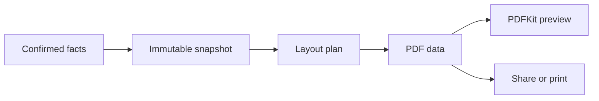

# Deterministic document pipeline

**Status:** `LOCKED`

## Core rule

Preview, sharing, saving, and printing consume the same PDF `Data`. The app must never maintain a separate visual approximation of the final document.

## Pipeline

### 1. DocumentSnapshot

An immutable, sendable value containing:

- canonical facts resolved for the selected document;
- accepted narrative text;
- template and page-size identifier;
- date-display style;
- cropped portrait data and transform;
- selected file-size ceiling;
- version ID and content hash.

### 2. LayoutPlan

Core Text measures Japanese strings using the exact embedded/system font descriptors used for rendering. The plan records every block, line fragment, page break, coordinate, and warning before drawing.

No layout decision occurs inside SwiftUI.

### 3. Validation

Block export for:

- missing required field;
- clipped text or unplaced record;
- invalid chronology requiring confirmation;
- portrait below minimum resolution;
- unsupported page configuration;
- rendered data above the chosen size ceiling.

Warnings identify the exact document, section, and field. The engine never solves overflow by silently deleting content.

### 4. Rendering

- Use `UIGraphicsPDFRenderer` and Core Graphics for pages and rules.
- Use Core Text for measured Japanese text layout.
- Begin each page explicitly and draw only from the completed `LayoutPlan`.
- Add PDF metadata without personal data beyond what is visible in the document.
- Render on a background task and support cancellation.

### 5. Preview and export

- Initialize `PDFDocument` from the renderer’s exact `Data`.
- Display it through `PDFView` bridged into SwiftUI.
- Pass the same `Data` or a file created from it to the native share sheet and print controller.
- Keep a short-lived cache keyed by snapshot hash; invalidate it when content or render settings change.

## File-size policy

Text remains vector content. The portrait is the main controllable source of size.

1. Render once at the normal portrait quality.
2. Measure exact PDF byte count.
3. If oversized, recompress/downsample only the portrait within the documented minimum quality.
4. Rerender and remeasure.
5. If still oversized, block export and explain the available corrective action.

Never reduce content, rasterize all text, or claim a target size before measuring the final bytes.

## Golden fixtures

- Standard single-page résumé.
- No portrait.
- Very long address and employer names.
- Multi-page work history with 1, 5, 15, and 30 employments.
- Japanese-era boundary dates.
- Mixed Japanese and Latin text.
- Long qualification names.
- A3 and A4 output.
- Every supported size ceiling.

Golden verification compares page count, normalized text extraction, bounding boxes, warnings, and rendered-page images. Raw PDF byte hashes alone are insufficient because metadata can change.

## Official references

- PDF renderer: https://developer.apple.com/documentation/uikit/uigraphicspdfrenderer
- PDF preview: https://developer.apple.com/documentation/pdfkit/pdfview
- PDF document model: https://developer.apple.com/documentation/pdfkit/pdfdocument

