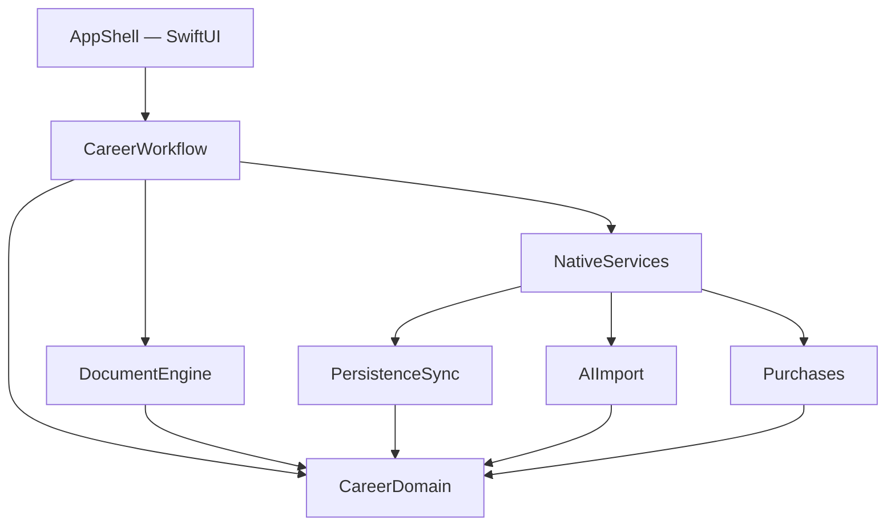

# System architecture

**Status:** `LOCKED`

## Architectural goal

Keep the high-risk logic—facts, versions, entitlements, and document output—small, deterministic, and independently testable. Apple frameworks sit behind adapters. SwiftUI coordinates flows but owns no business rules.

## Required UI foundation

The presentation baseline is [`lrodeveloperr/ios-18-shell`](https://github.com/lrodeveloperr/ios-18-shell). Do not design or build a second generic shell in this repository.

Reuse the audited shell for navigation structure, settings structure, adaptive iPhone/iPad layout, typography foundations, standard loading/empty/error states, accessibility behavior, paywall framing, and other reusable iOS 18 presentation conventions. This product supplies only its app-specific screens, document editor, PDF preview, OCR review, AI proposal review, application tracker, and dependency wiring.

The shell is a presentation dependency, not a business-logic dependency. `CareerDomain`, `CareerWorkflow`, `DocumentEngine`, `PersistenceSync`, `AIImport`, and `Purchases` must remain independently buildable and testable without it.

## Module graph



## Recommended repository code layout

```text
App/
  ShellIntegration/  # adopts lrodeveloperr/ios-18-shell
  Features/
Packages/
  CareerDomain/
  CareerWorkflow/
  DocumentEngine/
  PersistenceSync/
  AIImport/
  Purchases/
Tests/
  Fixtures/
  GoldenPDFs/
  StoreKit/
docs/
```

Each package should have its own tests. The app target performs dependency composition and contains presentation code only.

## Module responsibilities

### CareerDomain

Pure Swift types and rules:

- canonical career facts and stable IDs;
- document and application state machines;
- date normalization and Japanese-era conversion;
- validation errors and export eligibility;
- version identities and merge rules;
- entitlement vocabulary and free-usage ledger.

It must not import SwiftUI, SwiftData, CloudKit, Foundation Models, Vision, PDFKit, or StoreKit.

### CareerWorkflow

Application use cases:

- create/update a career profile;
- confirm imported facts;
- create a variant;
- request and accept an AI suggestion;
- render and export a document;
- record a completed export;
- connect a document version to an application.

It depends on domain protocols, not concrete Apple services.

### DocumentEngine

Transforms an immutable `DocumentSnapshot` into a `LayoutPlan`, validation report, and final `Data` containing the PDF. It owns typography, templates, pagination, overflow, photo placement, and file-size policy.

### PersistenceSync

Maps domain aggregates to SwiftData models, configures the private CloudKit-backed `ModelContainer`, performs migrations, and emits sync status. It does not leak SwiftData models into the domain.

### AIImport

Contains Foundation Models, Vision, and VisionKit adapters. It returns proposals and candidate facts, never saved domain entities.

### Purchases

Loads StoreKit products, verifies transactions, listens for updates, derives `EntitlementState`, and provides localized pricing to the UI.

### AppShell and Features

`ShellIntegration` adopts the reusable components and conventions from `lrodeveloperr/ios-18-shell`. Product-specific SwiftUI features provide career forms, OCR review, AI proposal review, application tracking, and document preview. This layer also wires permission explanations, the PDFKit bridge, share sheet, and print controller.

Generic shell components must be improved upstream in `ios-18-shell`, then consumed here. Product-specific behavior must stay here and must not be pushed into the shared shell.

## Dependency rules

- Dependencies point inward toward `CareerDomain`.
- Framework objects never become domain-model properties.
- Every native service has a protocol and deterministic test double.
- No singleton owns mutable business state.
- Long work runs use actors or structured concurrency and support cancellation.
- UI reads immutable view state produced by workflows.
- All permanent identifiers are generated before persistence and remain stable across synchronization.

## Deployment strategy

- Minimum OS: iOS/iPadOS 18 for the deterministic product.
- Foundation Models features compile behind iOS/iPadOS 26 availability and check `SystemLanguageModel.default.availability` at runtime.
- Unsupported devices retain manual editing, OCR, PDF creation, application tracking, purchases, and synchronization.
- CI compiles the baseline and newest SDK paths; native model responses are represented by fixtures in automated tests.

## Implementation order

1. CareerDomain models, validation, and state transitions.
2. DocumentSnapshot and deterministic renderer with golden fixtures.
3. SwiftData mapping, versioned schema, and CloudKit development container.
4. Workflow orchestration and test doubles.
5. StoreKit entitlements and limits.
6. OCR candidate extraction and confirmation.
7. Foundation Models suggestions and validation.
8. Integrate `lrodeveloperr/ios-18-shell` and add only the product-specific SwiftUI screens.
9. Device QA, CloudKit production schema, screenshots, and submission evidence.

## Official implementation references

- Foundation Models: https://developer.apple.com/documentation/foundationmodels
- SwiftData: https://developer.apple.com/documentation/swiftdata
- SwiftData cross-device synchronization: https://developer.apple.com/documentation/swiftdata/syncing-model-data-across-a-persons-devices
- StoreKit 2: https://developer.apple.com/storekit/
- VisionKit: https://developer.apple.com/documentation/visionkit
- Vision text recognition: https://developer.apple.com/documentation/vision/recognizing-text-in-images
- PDFKit: https://developer.apple.com/documentation/pdfkit
